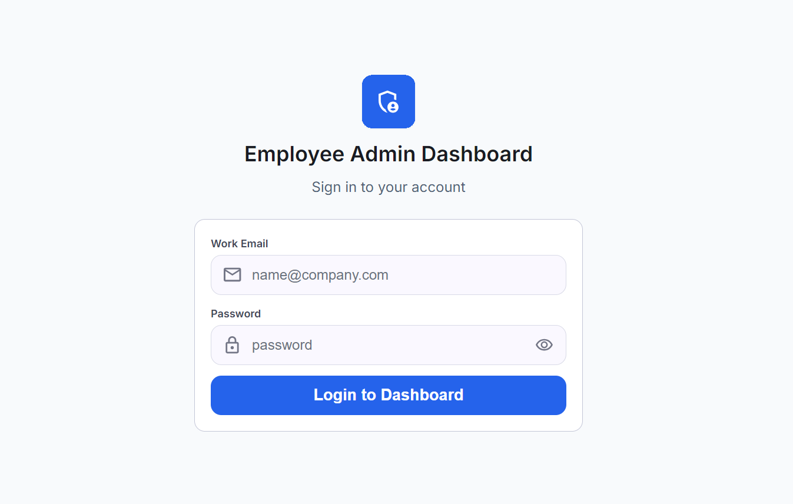
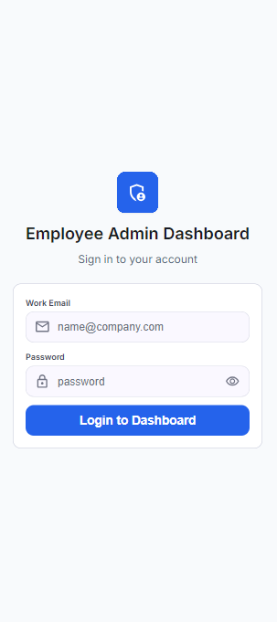
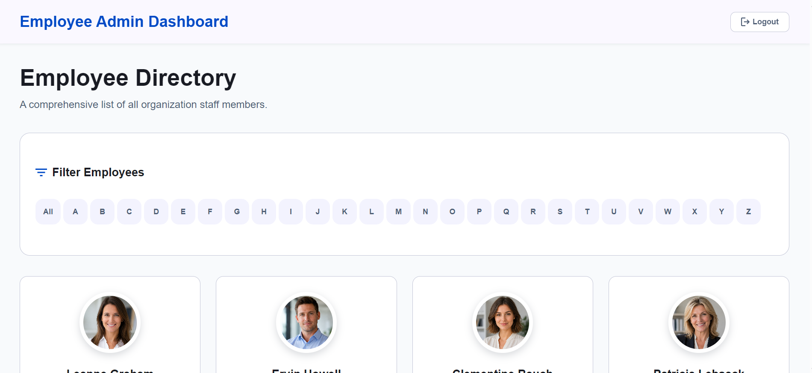
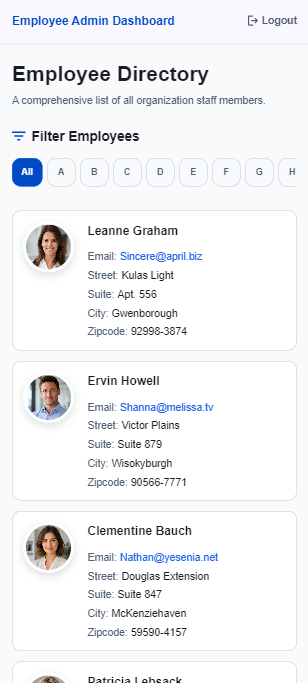
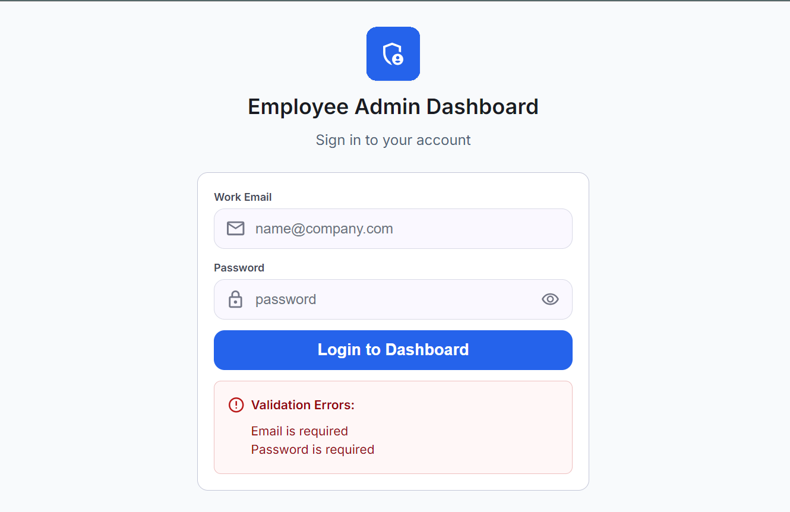
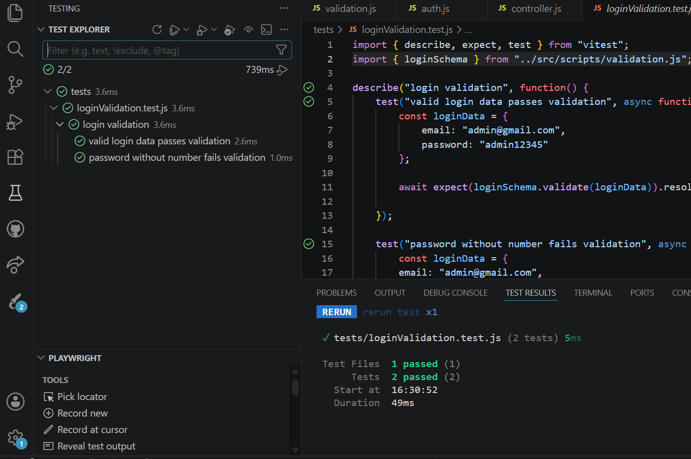
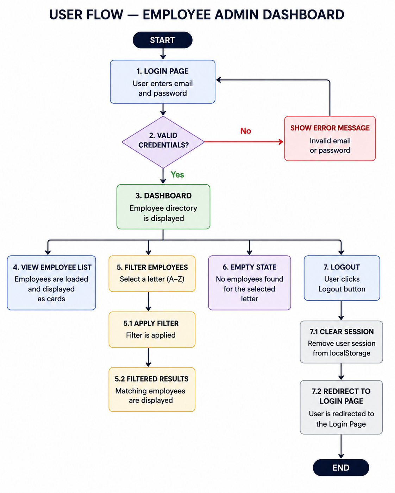

# 👩‍💼 Employee Admin Dashboard

## 📖 Project Description

Employee Admin Dashboard is a web application for administrative viewing of employee information.

The goal of the project is to create a simple management panel where an administrator can log in to the system, view a list of employees, check their contact details and address, filter employees by the first letter of their name from A to Z, and log out of the system.

Main features:

- login to the administrative panel using email and password;
- validation of entered credentials;
- display of an error message for an incorrect email or password;
- viewing the employee list as cards;
- viewing employees' main contact details and address;
- filtering employees by the first letter of their name from A to Z;
- displaying an empty state if no employees are found for the selected letter;
- logout with clearing of the user session.

The project is developed as an educational project using HTML, CSS, and JavaScript.

## 🎨 Prototype

Links to Figma prototypes:

- Desktop version: [Desktop Prototype](https://www.figma.com/design/6Vppb7sbX3zXrpHNfjIRhN/Untitled?node-id=0-1&p=f&t=RiVgx3eQZ0gzW7Wi-0)
- Mobile version: [Mobile Prototype](https://www.figma.com/design/6Vppb7sbX3zXrpHNfjIRhN/Untitled?node-id=9-1889&t=RiVgx3eQZ0gzW7Wi-0)
- Wireframe: [Wireframe](https://www.figma.com/design/6Vppb7sbX3zXrpHNfjIRhN/Untitled?node-id=4-430&p=f&t=RiVgx3eQZ0gzW7Wi-0)

## 📸 Screenshots

### 🖥️ Login Page





### 📊 Dashboard





### ⚠️ Login Validation Error



### 🧪 Tests



## 🔄 User Flow

User flow diagram:



User scenario:

1. The administrator opens the login page.
2. The administrator enters an email and password.
3. The system checks whether the entered data is correct.
4. If the email or password is incorrect, the system displays an error message and returns the user to the login form.
5. If the data is correct, the administrative panel opens.
6. The employee list is displayed in the panel as cards.
7. The administrator can select a letter of the English alphabet from A to Z to filter employees by the first letter of their name.
8. The system applies the filter and displays matching employees.
9. If there are no employees for the selected letter, an empty state is displayed with a message that no employees were found.
10. The administrator clicks the Logout button.
11. The system clears the user session from `localStorage`.
12. The user is redirected to the login page.

## ⚙️ Installation and Launch

### 📥 Cloning the Project

```bash
git clone https://github.com/hannafr14/employee-admin-dashboard.git
cd employee-admin-dashboard
```

### 📦 Installing Dependencies

```bash
npm install
```

### 🚀 Starting the Project

```bash
npm start
```

### 🧪 Running Tests

```bash
npm test
```

## 🗂️ Planning

A project schedule, user stories, tasks, and subtasks have been added in Jira.

Jira board link:

- [Employee Admin Dashboard Jira board](https://hannafrolova14.atlassian.net/jira/software/projects/EAD/boards/34/backlog)

## 👤 User Stories

### 1. 🔐 Access to the Administrative Panel

**As** an administrator  
**I want** to access the management panel using an email and password.  
**So that** I can manage employee information.

### 2. 👥 Employee List

**As** an authorized administrator user  
**I want** to see a list of employees.  
**So that** I can check their main contact details and address.

### 3. 🔎 Filtering Employees by the First Letter of Their Name

**As** an authorized administrator user  
**I want** to filter the employee list by the first letter of their name.  
**So that** I can find a specific employee faster.

### 4. 🚪 Logout from the Management Panel

**As** an authorized administrator user  
**I want** to be able to log out of the system through the management panel.  
**So that** no one else can use my open session.

## ✅ Acceptance Criteria

The project is considered complete if:

- README contains the project description, prototype, user scenario, installation, planning, user stories, acceptance criteria, and authors;
- the basic project structure has been created;
- the user can open the login page;
- the login form accepts an email and password;
- the system checks the entered credentials;
- an error message is displayed if the email or password is incorrect;
- after a successful login, the user sees the administrative panel;
- the employee list is displayed in the panel as cards;
- employees' main contact details and address are displayed;
- the user can select a letter of the English alphabet from A to Z to filter employees;
- after selecting a letter, only matching employees are displayed;
- if there are no matching employees, an empty state is displayed;
- the user can log out of the system;
- after logout, the session is removed from `localStorage`;
- after logout, the user is redirected to the login page;
- the main functions are covered by tests;
- the project can be launched locally using the instructions from README.

## 🔐 Admin Credentials

Email: admin@gmail.com

Password: admin12345

## ✍️ Authors

- Author name: Hanna
- GitHub: [hannafr14](https://github.com/hannafr14)
